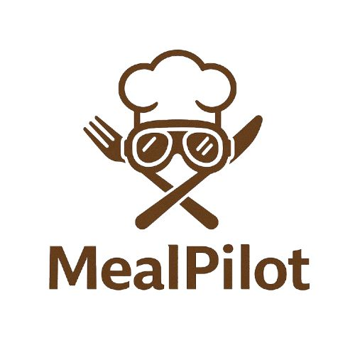
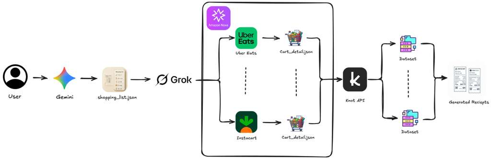

  
  
  # 🥘 MealPilot: Co-Pilot for your grocery shopping

An intelligent grocery comparison platform that helps you find the **best prices** groceries across multiple delivery platforms like **Instacart, Uber Eats, Amazon Groceries**, etc. 

  ## [Youtube Video - Link](https://www.youtube.com/watch?v=Ezjk6Yx-GTk)
  

---

## ✨ Features

- 🔍 **Smart Recipe Search** - Enter any recipe name and get instant ingredient lists
- 📊 **Multi-Platform Price Comparison** - Compare prices across Instacart, Uber Eats, and more
- 💰 **Instant Savings Calculator** - See exactly how much you save by choosing the best deal
- 📦 **Order History** - Track all your past orders with detailed receipts
- 🎨 **Beautiful UI** - Clean, modern design with intuitive navigation
- ⚡ **Real-Time Updates** - Live price comparison updates as you shop

---

## 🏗️ System Architecture

  

### Architecture Overview

**Frontend (Next.js)** → **Backend API (FastAPI)** → **Automation Agents (Selenium)** → **E-commerce Platforms**

1. **User Interface Layer**: React/Next.js frontend with beautiful MealPilot branding
2. **API Layer**: FastAPI backend handling requests and orchestrating operations
3. **Automation Layer**: Selenium-based agents for platform-specific interactions
4. **Data Processing Layer**: Gemini AI for recipe parsing, Knot API for order formatting
5. **Storage Layer**: Supabase for user data, orders, and statistics

---

## 🏗️ Tech Stack

### Frontend
- **Next.js 14** - React framework with App Router
- **TypeScript** - Type-safe development
- **Tailwind CSS** - Utility-first styling
- **Custom Design System** - MealPilot brand colors and components

### Backend
- **Amazon Nova Act** - Web Automation Agents
- **Gemini API** - AI-powered recipe parsing
- **Supabase** - Database and authentication
- **Knot API** - E-commerce integration
- **FastAPI** - Modern Python web framework

---

## 📱 How It Works

### 1️⃣ Search for Recipe
Enter any recipe name (e.g., "Spaghetti Carbonara" or "Veggie Pizza")

### 2️⃣ Review Ingredients
AI extracts and lists all required ingredients with quantities

### 3️⃣ Compare Prices
Our automation searches across platforms and compares prices in real-time

### 4️⃣ Save Money
Choose the best deal and save on your grocery shopping!

---

## 🎯 Key Capabilities

### Automated Price Comparison
- Searches multiple platforms simultaneously
- Extracts accurate pricing data
- Calculates totals including tax
- Identifies the best deal automatically

### Smart Recipe Processing
- Uses Google Gemini AI for intelligent recipe parsing
- Extracts ingredients with quantities and units
- Handles various recipe formats
- Suggests alternatives when items aren't found

### Order Management
- Complete order history
- Detailed receipts with itemized pricing
- Order status tracking
- Receipt image generation (Phase 3)

---

**Built with ❤️ for smarter grocery shopping**

© 2025 MealPilot. All rights reserved.